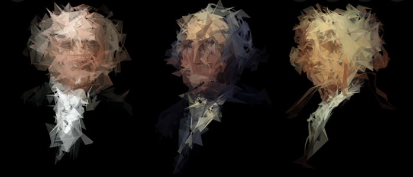
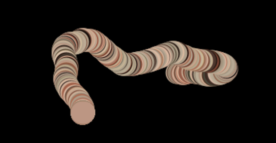
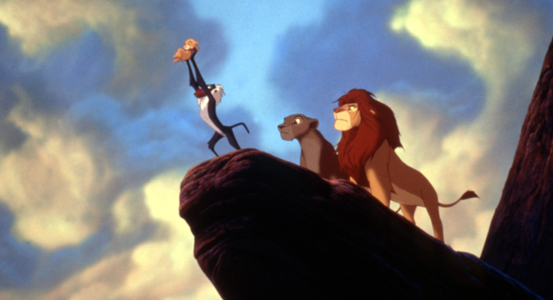
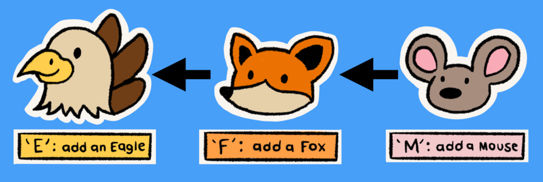
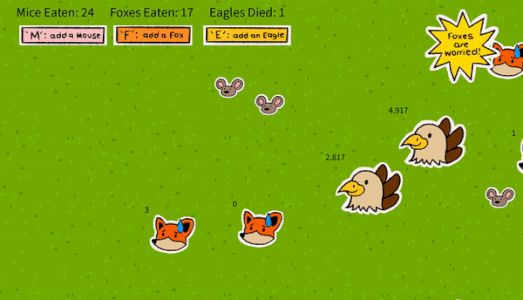
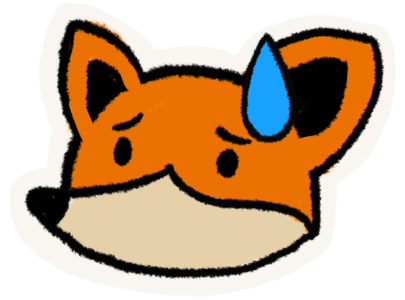
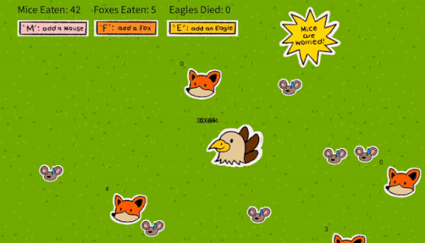
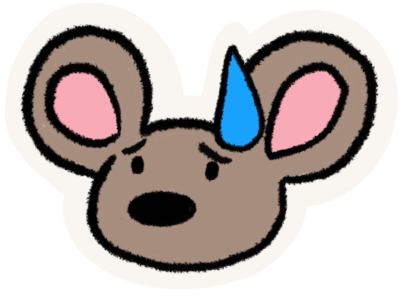

# FINAL PROJECT: Interactive Ecosystem

## Previous Idea
Deciding the topic of my project was not easy, as I actually wanted it to be a virtual painting experience, where the Processing window would take a picture of the audience, present a black screen, and users would be able to paint the canvas through a series of lined particles, revealing the picture accordingly.

However, after a series of failed attempts, I realized that this is not possible, as the particle trail was only seen if a background wasn’t implemented. Because of this, the black background causes only the circular shape of the line’s tip to be seen, making use of a multitude of different RGB values from the picture instead of revealing it instead (Figure 1).

## Inspiration
 After this failed attempt, I decided to start from scratch once more and focus my project on the world around me. I was inspired by the Circle of Life in Lion King, specifically in what Mufasa said about how deer eat the grass, lions eat the deer, and lions die and become the grass that the deer eat once again. With this, I wanted to implement certain behaviors in my Processing particles such as following, worry, and avoidance.

## Process
### Story
For the story, I wanted it to closely follow real life. With this, I created drawings of the same style in the form of a food chain, obviously making the eagles at the top of the food chain, which it will then transition to foxes, then mice.

In the code, I implemented certain behaviors to the Eagle so it would follow the closest Fox, and if it got close enough, it would "eat" the fox and the fox would disappear from the arraylist. This would similarly happen with foxes and mice, where the fox would eat the closest mouse.

In order to add the behavior of worry, when a certain number of mice or foxes exceeded the normal ratio of the food chain, they would change their image animation and a warning would pop up on the corner.

Foxes:

Mouse:

## Interactivity

